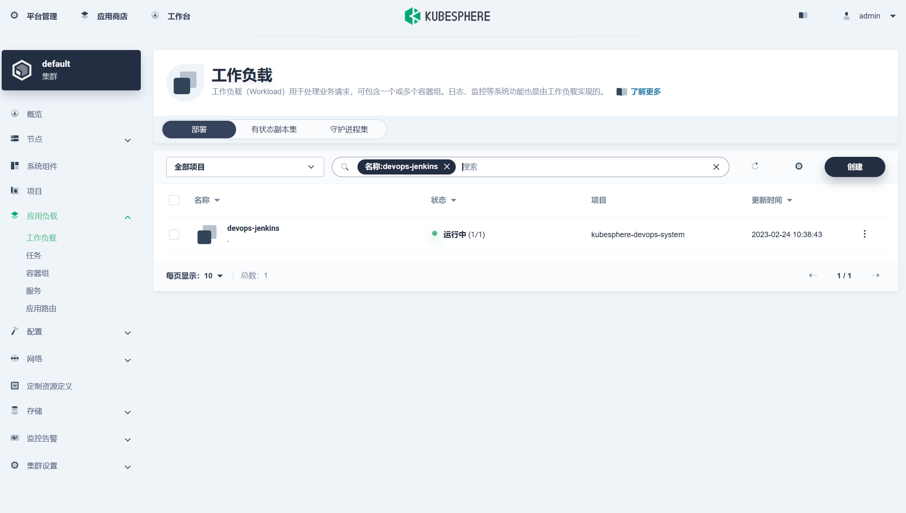
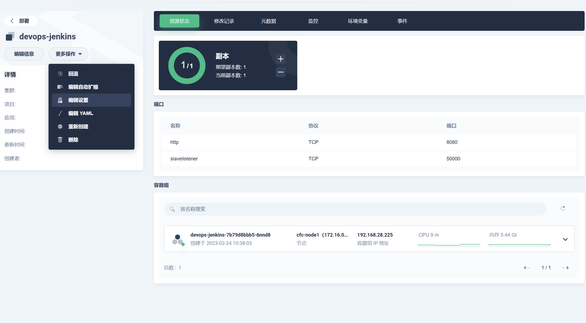
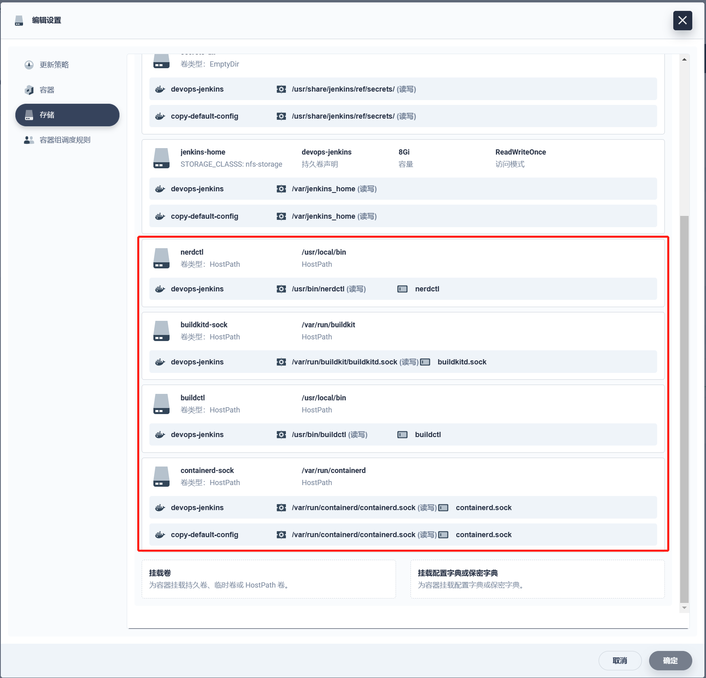
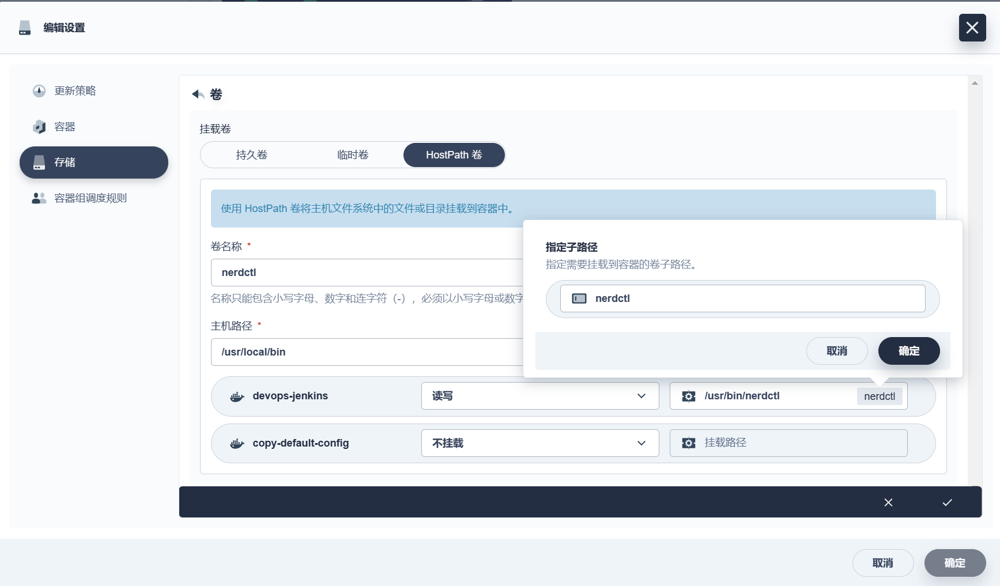
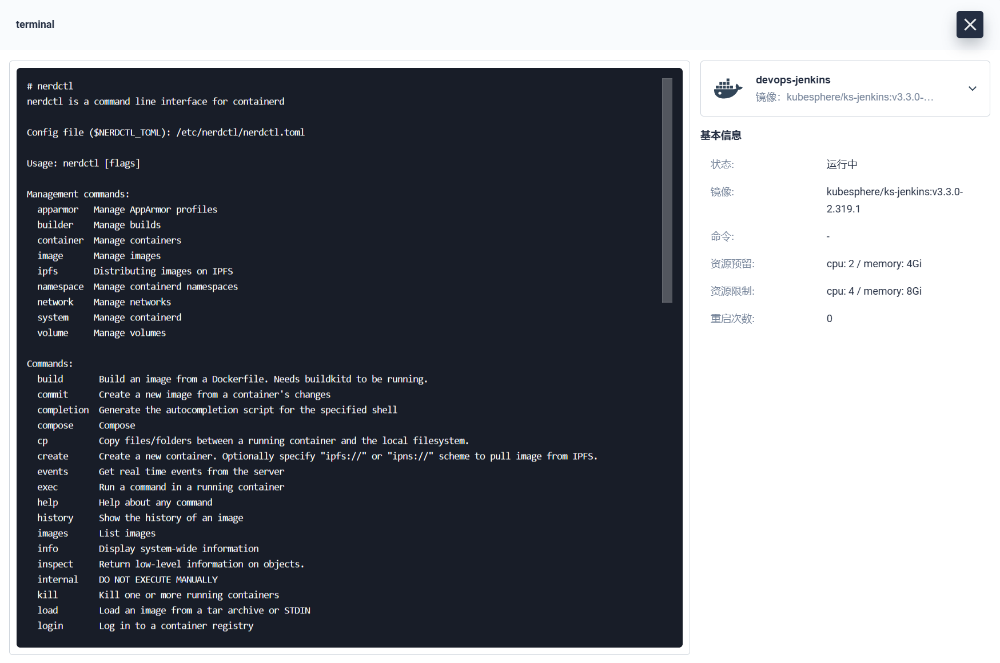
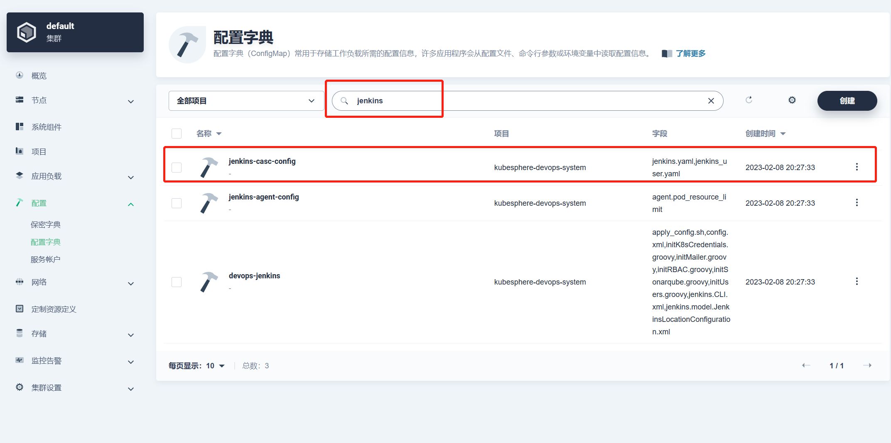
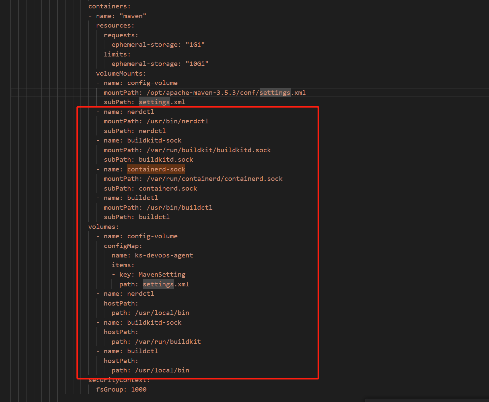

## devops-jenkins使用nerdctl

首先使用admin账户登录kubesphere，进入到工作负载中，搜索devops-jenkins进入



进行编辑设置



主要是对存储进行编辑，挂载宿主机上的nerdctl相关文件，让devops-jenkins也能够使用nerdctl

nerdctl，buildkitd.sock，buildctl，containerd.sock挂载如下图所示



注意

这些配置都需要设置子路劲

示例



然后等待devops-jenkins重新创建，进入终端使用nerdctl就不会报 `-bash: nerdctl: command not found`

会显示nerdctl的信息



到这里，devops-jenkins是可以正常使用了，但是创建流水线是一个新的maven容器，还是会报`-bash: nerdctl: command not found`。

这里主要是对maven进行修改，其他类同。

所以还需要对通过jenkins创建的容器进行挂载devops-jenkins上的nerdctl相关配置。

## pipeline使用nerdctl

进入配置-配置字典-搜索jenkins，找到jenkins-casc-config进行编辑yaml修改内容。



首先选择你要修改的容器，这里以maven为例。

对maven容器下的volumeMounts和volumes添加挂载配置



配置内容截取

```
volumeMounts:
- name: config-volume
mountPath: /opt/apache-maven-3.5.3/conf/settings.xml
subPath: settings.xml
- name: nerdctl
mountPath: /usr/bin/nerdctl
subPath: nerdctl
- name: buildkitd-sock
mountPath: /var/run/buildkit/buildkitd.sock
subPath: buildkitd.sock
- name: containerd-sock
mountPath: /var/run/containerd/containerd.sock
subPath: containerd.sock                           
- name: buildctl
mountPath: /usr/bin/buildctl
subPath: buildctl

volumes:
- name: config-volume
configMap:
name: ks-devops-agent
items:
- key: MavenSetting
path: settings.xml
- name: nerdctl
hostPath:
path: /usr/local/bin
- name: buildkitd-sock
hostPath:
path: /var/run/buildkit
- name: buildctl
hostPath:
path: /usr/local/bin 
```

然后重新创建devops-jenkins工作负载，就可以在jenkins以及创建的pipeline中使用nerdctl进行登录容器仓库，打包镜像，推送镜像操作。

附一份完整的pipeline

```
pipeline {
    agent {
        node {
            label 'maven'
        }

    }
    parameters {
        string(name: 'PROJECT_NAME', defaultValue: '', description: '')
        string(name: 'PROJECT_VERSION', defaultValue: 'v1.0.0', description: '')
    }
    environment {
        DOCKER_CREDENTIAL_ID = 'dockerhub-id'
        GITHUB_CREDENTIAL_ID = 'github-id'
        KUBECONFIG_CREDENTIAL_ID = '发布到k8s的凭证'
        REGISTRY = '容器仓库地址'
        DOCKERHUB_NAMESPACE = '容器仓库地址命名空间'
        GITHUB_ACCOUNT = 'kubesphere'
    }
    stages {
        stage('拉取代码') {
            agent none
            steps {
                container('maven') {
                    git(url: 'git地址', credentialsId: 'gitee', branch: 'master', changelog: true, poll: false)
                    sh 'ls -al'
                }
            }
        }

        stage('项目编译') {
            agent none
            steps {
                container('maven') {
                    sh 'ls'
                    sh 'mvn clean package -Dmaven.test.skip=true'
                }

            }
        }

        stage('构建镜像') {
            parallel {
                stage('构建xxx镜像') {
                    agent none
                    steps {
                        container('maven') {
                            sh 'nerdctl build -t $REGISTRY/$DOCKERHUB_NAMESPACE/$PROJECT_NAME:SNAPSHOT-$BUILD_NUMBER -f $PROJECT_NAME/Dockerfile'
                        }

                    }
                }
            }
        }

        stage('推送镜像') {
            parallel {
                stage('推送xxx镜像') {
                    agent none
                    steps {
                        container('maven') {
                            withCredentials([usernamePassword(credentialsId: 'aliy-hub-id', usernameVariable: 'DOCKER_USER_VAR', passwordVariable: 'DOCKER_PWD_VAR',)]) {
                                sh 'echo "$DOCKER_PWD_VAR" | nerdctl login $REGISTRY -u "$DOCKER_USER_VAR" --password-stdin'
                                sh 'nerdctl tag $REGISTRY/$DOCKERHUB_NAMESPACE/$PROJECT_NAME:SNAPSHOT-$BUILD_NUMBER $REGISTRY/$DOCKERHUB_NAMESPACE/$PROJECT_NAME:$PROJECT_VERSION'
                                sh 'nerdctl push  $REGISTRY/$DOCKERHUB_NAMESPACE/$PROJECT_NAME:$PROJECT_VERSION'
                            }

                        }

                    }
                }
            }
        }

        stage('部署到dev环境') {
            parallel {
                stage('xxx部署到dev环境') {
                    agent none
                    steps {
                        container('maven') {
                            withCredentials([kubeconfigContent(credentialsId : 'demo-kubeconfig' ,variable : 'KUBECONFIG_CONTENT' ,)]) {
                                sh '''ls
                                mkdir ~/.kube
                                echo "$KUBECONFIG_CONTENT" > ~/.kube/config
                                envsubst < $PROJECT_NAME/deploy/delivery-deploy.yaml | kubectl apply -f -
                                '''
                            }
                        }
                    }
                }
            }
        }
    }
}
```

